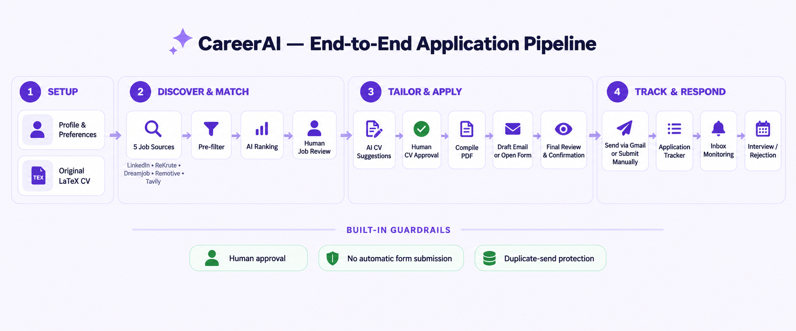

# Career Agent

[View screenshots of the application](APP_PREVIEW.md)

## End-to-end pipeline



## Before you start

This repository contains no credentials or personal application data. Copy
`.env.example` to `.env`, add the API keys for the providers you use, and replace
the placeholder content in `data/base_cv.tex` with your own CV. To use Gmail,
download an OAuth desktop-client file from Google Cloud as `credentials.json`;
the generated `token.json` remains local and is ignored by Git.

## CareerAI web app (Next.js + FastAPI)

The new frontend includes Dashboard, Workflow, Applications, Application Tracker,
and Settings. It uses the existing Python services and application database.
See [web setup and architecture](frontend/README.md) for details.

```powershell
uv sync
cd frontend
npm.cmd install
npm.cmd run build
cd ..
.venv\Scripts\python.exe scripts/run_web.py
```

Open http://127.0.0.1:3000. The API documentation is at http://127.0.0.1:8000/docs.
CV and email edits are saved between sessions. Applications are sent only after
the final review and confirmation.

## Streamlit dashboard

Install the project dependencies and start the frontend:

```powershell
.\.venv\Scripts\python.exe -m pip install -e .
.\.venv\Scripts\python.exe -m streamlit run app.py
```

Use the sidebar to save a candidate profile, then search and rank jobs from
the configured sources. Ranked jobs are saved to the SQLite applications
table and displayed in the Applications tab.

Searches can take a few minutes while the sources respond and jobs are ranked.
Matching roles are saved as `found`; repeating a search preserves existing
application statuses and notes. Selecting a role starts the application review.

To exercise the dashboard search form against live services, run
`python scripts/check_streamlit_search.py`. It stops at the job shortlist and
writes a local diagnostic report to `data/streamlit_search_report.json`.

## Application Center and recruiter responses

Restart Streamlit after upgrading to initialize the additional tracking tables.
Existing jobs and application statuses are retained.

1. Open **Application Center** and select a saved role.
2. Review its detected application method. Detection uses collected job metadata,
   application links, and description text. Easy Apply is shown only when the
   listing explicitly provides that evidence; otherwise a LinkedIn page is shown
   as unconfirmed. LinkedIn login-only content is not automatically inspected.
3. Upload a tailored CV PDF if desired, then choose **Generate tailored application
   email**. Review/edit the recipient, subject, and body. **Save draft** persists
   the draft; the authorization checkbox and **Send via Gmail** send it.
4. For external forms or Easy Apply, open the provided link, submit on that site,
   then use **Mark application submitted**. The app does not automate those forms.
5. Use **Update status and view history** for manual updates and the audit trail.

The existing CV-tailoring workflow also records sent message and thread IDs.
An application becomes `applied` only after Gmail confirms sending or you confirm
manual submission. Duplicate sends are blocked. If sending times out, use
**Resolve an uncertain send** to verify the sent message or confirm it was not sent.

For inbox monitoring, click **Connect Gmail** once. The existing `credentials.json`
must be an OAuth desktop client with Gmail API enabled. Authorize both sending and
read-only mailbox access; a previous send-only token needs renewed consent.
Then enable **Check inbox automatically** and choose the interval, or click
**Check inbox now**. The dashboard checks while its session is open. To poll while
the dashboard is closed, keep this process running (or launch it at login):

```powershell
.\.venv\Scripts\python.exe scripts/check_application_inbox.py --watch
```

The worker respects the dashboard's enabled flag and interval and never launches
OAuth itself. For command-line authorization use `--connect`; omit `--watch` to
perform one check. Stopping the worker and closing the dashboard stops polling.

Replies are matched by recorded Gmail thread ID, or by an unambiguous exact
recipient plus role title. Unmatched or ambiguous recruitment messages go to a
review queue. Recruiter replies have two decision classes: **Rejected** and
**Accepted for interview**. Their text, sender, subject, and timestamp appear in
the Application Center.
Acknowledgements, automatic replies, and unclear wording remain unclassified
for review rather than being guessed as accepted or rejected. Older saved replies
use the previously stored excerpt; new replies store up to 12,000 characters of
response text with quoted history removed. Advanced statuses are not rolled back by
acknowledgements or older messages. Messages, attachments, and drafts are not
forwarded to an AI service for inbox classification; only tailored email drafting
uses the configured model. Inbox checks do not mark messages read or send replies.

Tracking starts when an application is submitted through the module or marked
submitted manually. Existing applications without submission metadata can be
marked applied in the Application Center to begin monitoring future responses.

API references: [Gmail scopes](https://developers.google.com/workspace/gmail/api/auth/scopes)
and [LinkedIn application methods](https://www.linkedin.com/help/linkedin/answer/a512388/applying-for-jobs-on-linkedin?lang=en).

## Filter all job sources by publication start date

To watch all five configured search methods and inspect their results:

```powershell
python main.py --search-only --query "AI Engineer" --limit 5
python main.py --search-only --query "AI Engineer" --date 2026-09-01
```

Each source prints its start, completion time or error, and matching jobs with
publication dates and URLs. Omit `--search-only` to continue through the full
ranking and application workflow with the same search output.

In the dashboard, open **Search preferences** and choose **Published on or after**.
The selected date is inclusive: September 1 keeps offers from September 1 and
every later day. Leave it empty to use source defaults. The command-line workflow also
accepts `python main.py --date 2026-09-01`.

In Python:

```python
from src.tools.job_collector import search_all_jobs

jobs = search_all_jobs("AI Engineer", post_date="2026-09-01")
```

The same optional `post_date` argument accepts a `datetime.date` or `YYYY-MM-DD`
string in all individual job-search methods: LinkedIn jobs, LinkedIn post search,
recruiter posts, ReKrute, Dreamjob, Remotive, Emploi.ma, Arbeitnow, and the
`search_jobs` agent. The collector combines LinkedIn jobs, ReKrute, Dreamjob,
Remotive, and Tavily-based LinkedIn post search. Recruiter discovery is no longer
part of the collector. Without `post_date`, the Tavily source uses its default
one-day freshness window.

Timezone-aware timestamps are compared in UTC. Dates without a timezone retain
the source's reported calendar day. Missing or unreadable publication dates are
excluded only when the filter is enabled. Filtering applies to results available
from each source; it does not guarantee a complete historical archive, and
source retrieval/page limits may yield fewer matches than requested.
